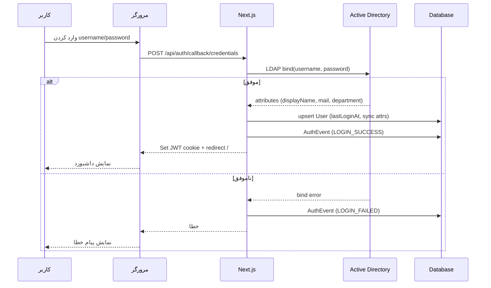
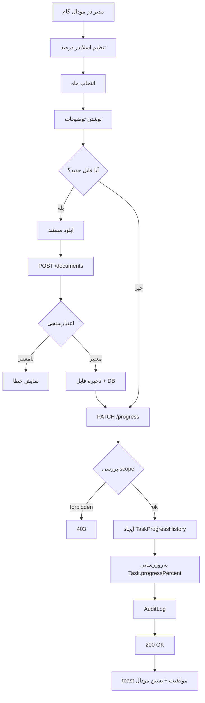
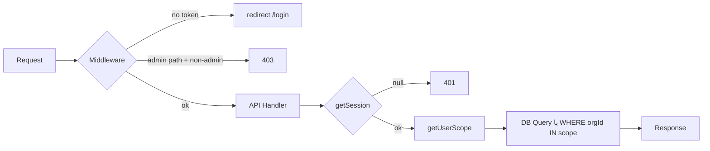
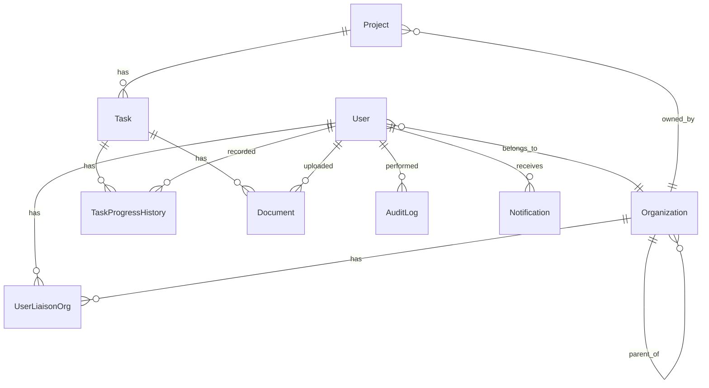

# سند مشخصات فنی و کاربری — سامانه مدیریت پروژه‌ها و گام‌های کاری (نسخه ۲.۰)

**پورتال واحدها با احراز هویت Active Directory و کنترل دسترسی مبتنی بر نقش (RBAC)**

---

## فهرست

1. [مقدمه و خلاصه اجرایی](#۱-مقدمه-و-خلاصه-اجرایی)
2. [معماری کلی سامانه](#۲-معماری-کلی-سامانه)
3. [احراز هویت و کنترل دسترسی](#۳-احراز-هویت-و-کنترل-دسترسی)
4. [مدل داده‌ای (Data Model)](#۴-مدل-داده‌ای-data-model)
5. [مشخصات API](#۵-مشخصات-api)
6. [محیط‌های کاربری و صفحات](#۶-محیط‌های-کاربری-و-صفحات)
7. [جریان‌های کاری (Workflows)](#۷-جریان‌های-کاری-workflows)
8. [ساختار پروژه Next.js](#۸-ساختار-پروژه-nextjs)
9. [توصیه‌های پیاده‌سازی](#۹-توصیه‌های-پیاده‌سازی)
10. [امنیت](#۱۰-امنیت)
11. [کارایی و مقیاس‌پذیری](#۱۱-کارایی-و-مقیاس‌پذیری)
12. [نمونه‌های کد](#۱۲-نمونه‌های-کد)
13. [نمودارهای فنی](#۱۳-نمودارهای-فنی)
14. [چک‌لیست تحویل](#۱۴-چک‌لیست-تحویل)

---

## ۱. مقدمه و خلاصه اجرایی

### ۱.۱ هدف
سامانه‌ای یکپارچه برای مدیریت پروژه‌ها و گام‌های کاری در سطح سازمان **بیمه تجارت‌نو**، که هر کاربر بر اساس نقش خود محیط اختصاصی می‌بیند و تنها به اطلاعات حوزه‌ی سازمانی خود دسترسی دارد. سامانه با **Active Directory** سازمان یکپارچه می‌شود تا ورود یکپارچه (SSO-like) فراهم گردد.

### ۱.۲ دامنه
این سند مشخصات **فاز ۲** سامانه PMO موجود است. فاز ۱ (داشبورد، گانت، گزارش‌ها، فرهنگنامه) قبلاً پیاده‌سازی شده و این سند لایه‌ی **احراز هویت + پورتال واحدها + مدیریت مستندات گام‌ها** را بر آن می‌افزاید.

### ۱.۳ نقش‌های کاربری
| نقش | کلید | حوزه دید داده | اختیارات |
|---|---|---|---|
| ادمین سیستم | `ADMIN` | کل شرکت | مدیریت کاربران، نقش‌ها، پروژه‌ها، گام‌ها، تنظیمات + دیدن همه گزارشات |
| مدیر واحد | `MANAGER` | واحد خود + زیرمجموعه‌های سلسله‌مراتبی | مشاهده پروژه/گام‌های حوزه، ثبت درصد پیشرفت، آپلود مستندات |
| رابط مدیریت | `LIAISON` | همانند مدیر | همانند مدیر (نقش مشابه) |
| مشاهده‌کننده (پیش‌فرض) | `VIEWER` | همانند مدیر | فقط مشاهده، بدون ویرایش |

> **نکته:** مدیر و رابط از نظر دسترسی به داده و عملیات **یکسان** هستند؛ تفاوت فقط عنوان سازمانی است. ادمین نقش کاملاً مجزا با دسترسی کل شرکت دارد.

### ۱.۴ خلاصه معماری
- **Frontend:** Next.js 16 (App Router) + React 19 + TypeScript + Tailwind CSS 4 + shadcn/ui
- **Backend:** Next.js API Routes (Route Handlers) + Prisma ORM + SQLite (محیط توسعه) / قابل ارتقا به PostgreSQL
- **احراز هویت:** NextAuth.js v4 با `CredentialsProvider` + یکپارچگی LDAP/Active Directory در بک‌اند
- **ذخیره‌سازی فایل:** فایل‌سیستم محلی `/storage/documents/` با متادیتا در DB (قابل ارتقا به S3/MinIO)
- **مدیریت نشست:** JWT session مبتنی بر کوکی HttpOnly

---

## ۲. معماری کلی سامانه

### ۲.۱ نمودار معماری لایه‌ای

```
┌─────────────────────────────────────────────────────────────┐
│                     مرورگر کاربر (RTL)                       │
│  ┌─────────────┐  ┌──────────────┐  ┌────────────────────┐ │
│  │ صفحه ورود   │  │ داشبورد شخصی │  │ پورتال نقش‌محور    │ │
│  └─────────────┘  └──────────────┘  └────────────────────┘ │
└───────────────────────────┬─────────────────────────────────┘
                            │ HTTPS + JWT Cookie
┌───────────────────────────▼─────────────────────────────────┐
│                 Next.js 16 (App Router)                      │
│  ┌──────────┐  ┌──────────────┐  ┌──────────────────────┐  │
│  │Middleware│→ │  Pages (RSC) │  │  API Route Handlers  │  │
│  │ (RBAC)   │  │  + Client    │  │  /api/auth/*         │  │
│  └──────────┘  │  Components  │  │  /api/portal/*       │  │
│                └──────────────┘  │  /api/admin/*        │  │
│                                  └──────────────────────┘  │
└───────┬───────────────────────────────────┬─────────────────┘
        │                                   │
        ▼                                   ▼
┌───────────────────┐              ┌────────────────────────┐
│  Active Directory │              │   Prisma ORM           │
│  (LDAP server)    │              │   ↓                    │
│  - اعتبarsنجی     │              │   SQLite / Postgres    │
│  - خواندن پروفایل │              │   + File Storage       │
└───────────────────┘              │   /storage/documents/  │
                                   └────────────────────────┘
```

### ۲.۲ پشته فناوری قطعی
| لایه | فناوری | نسخه |
|---|---|---|
| Framework | Next.js (App Router) | 16.x |
| UI Library | React | 19.x |
| Language | TypeScript | 5.x (strict) |
| Styling | Tailwind CSS | 4.x |
| Components | shadcn/ui (New York) | latest |
| Icons | lucide-react | latest |
| ORM | Prisma | 6.x |
| Auth | next-auth | 4.24.x |
| LDAP | ldapjs (یا activedirectory2) | 3.x |
| State (client) | Zustand | 5.x |
| State (server) | TanStack Query | 5.x |
| Forms | react-hook-form + zod | latest |
| Charts | Recharts | 2.x |
| Jalali date | jalaali-js | 1.x |
| Runtime | Bun | 1.3.x |

### ۲.۳ اصول طراحی
1. **RTL اول** — تمام رابط از راست به چپ (dir="rtl")، فونت فارسی (Vazirmatn).
2. **Server-First** — Components سرور برای بارگذاری اولیه، Client فقط برای تعامل.
3. **Type-Safe End-to-End** — Zod schema‌ها هم برای validation هم برای type inference.
4. **Signature-Based Fetch** — الگوی موجود با `useRef` برای جلوگیری از stale request (در کامپوننت‌های کلاینت).
5. **RBAC در سه لایه** — Middleware (مسیر) + API (endpoint) + UI (عناصر).

---

## ۳. احراز هویت و کنترل دسترسی

### ۳.۱ یکپارچگی Active Directory

#### ۳.۱.۱ مکانیزم
از آنجا که Next.js به‌طور مستقیم نمی‌تواند با AD صحبت کند، یک **LDAP adapter** در بک‌اند (در API Route لاگین) قرار می‌گیرد که با `ldapjs` به AD متصل می‌شود:

```
[کاربر در مرورگر]
    ↓ username + password
[POST /api/auth/callback/credentials]
    ↓
[LDAP Adapter (server-side)]
    ├── bind با user DN ساخته‌شده از username
    ├── search برای خواندن attributes (displayName, mail, memberOf, department)
    └── در صورت موفقیت → ایجاد/به‌روزرسانی User در DB + صدور JWT
    ↓
[NextAuth session cookie]
```

#### ۳.۱.۲ ساختار DN
برای سازمان‌هایی با ساختار استاندارد AD، DN کاربر به‌صورت دینامیک ساخته می‌شود:
```
CN={username},CN=Users,DC=tejaratno,DC=ir
```
یا با **domain prefix**: `TEJARATNO\{username}`. این پیکربندی‌پذیر است در `SystemSetting`.

#### ۳.۱.۳ Auto-Provisioning
اولین ورود کاربر از AD:
- اگر `User` با آن `username` در DB نبود، **به‌طور خودکار ساخته می‌شود** با `role = VIEWER` و `orgId = null`.
- ادمین پس از آن نقش و واحد را تخصیص می‌دهد.
- در ورودهای بعدی، attributes (نام، ایمیل، department) از AD sync می‌شود.

#### ۳.۱.۴ پیکربندی (در `.env` یا `SystemSetting`)
```
AD_URL=ldap://dc01.tejaratno.ir:389
AD_BASE_DN=DC=tejaratno,DC=ir
AD_BIND_DN=CN=srv-nextjs,CN=Users,DC=tejaratno,DC=ir
AD_BIND_PASSWORD=********
AD_USERNAME_FORMAT=TEJARATNO\\{username}    # یا CN={username},CN=Users,...
AD_SYNC_ATTRIBUTES=displayName,mail,department,memberOf
```

> **برای محیط توسعه/سندباکس** (بدون دسترسی به AD واقعی): یک **fallback provider** محلی با کاربران seed شده در DB فعال می‌شود (با یک flag `AUTH_MODE=LOCAL|AD`). این اجازه می‌دهد توسعه‌دهنده‌ها بدون AD سیستم را تست کنند.

### ۳.۲ جریان ورود

```
┌─────────┐     ┌──────────┐     ┌─────────┐     ┌──────────┐
│ /login  │────▶│ validate │────▶│ AD bind │────▶│ sync DB  │
│ (form)  │     │ (zod)    │     │ (ldapjs)│     │ (upsert) │
└─────────┘     └──────────┘     └─────────┘     └────┬─────┘
                                                       │
                          ┌────────────────────────────┘
                          ▼
                  ┌───────────────┐     ┌──────────────┐
                  │ issue JWT     │────▶│ set cookie   │
                  │ (NextAuth)    │     │ HttpOnly     │
                  └───────────────┘     └──────┬───────┘
                                               │
                                  ┌────────────▼───────────┐
                                  │ redirect به /          │
                                  │ (با نقش کاربر)         │
                                  └────────────────────────┘
```

**موارد خطا:**
- AD unreachable → پیام «سرویس احراز هویت موقتاً در دسترس نیست» + fallback به LOCAL اگر فعال باشد.
- Invalid credentials → «نام کاربری یا رمز عبور نادرست است».
- کاربر در AD غیرفعال (`userAccountControl: 514`) → «حساب کاربری شما غیرفعال است».

### ۳.۳ مدیریت نشست (Session)
- **استراتژی:** JWT (بدون دیتابیس session) برای سادگی و مقیاس‌پذیری.
- **Cookie:** `next-auth.session-token`، HttpOnly، Secure (در prod)، SameSite=Lax.
- **مدت اعتبار:** ۸ ساعت (روز کاری)؛ با `maxAge` در NextAuth config.
- **محتوای JWT:**
  ```typescript
  {
    sub: userId,
    role: 'ADMIN' | 'MANAGER' | 'LIAISON' | 'VIEWER',
    orgId: string | null,
    name: string,
    email: string | null,
    iat, exp
  }
  ```

### ۳.۴ مدل RBAC

#### ۳.۴.۱ ماتریس دسترسی کامل
| منبع / عمل | ADMIN | MANAGER | LIAISON | VIEWER |
|---|---|---|---|---|
| **داشبورد شخصی** | ✓ (کل شرکت) | ✓ (حوزه خود) | ✓ (حوزه خود) | ✓ (حوزه خود) |
| **لیست پروژه‌ها** | ✓ همه | ✓ خود+زیرمجموعه | ✓ خود+زیرمجموعه | ✓ خود+زیرمجموعه |
| **لیست گام‌ها** | ✓ همه | ✓ خود+زیرمجموعه | ✓ خود+زیرمجموعه | ✓ خود+زیرمجموعه |
| **ثبت درصد پیشرفت** | ✓ همه | ✓ حوزه خود | ✓ حوزه خود | ✗ |
| **آپلود مستندات** | ✓ همه | ✓ حوزه خود | ✓ حوزه خود | ✗ |
| **حذف مستندات** | ✓ | ✓ (مال خود) | ✓ (مال خود) | ✗ |
| **ایجاد/ویرایش پروژه** | ✓ | ✗ | ✗ | ✗ |
| **ایجاد/ویرایش گام** | ✓ | ✗ | ✗ | ✗ |
| **مدیریت کاربران** | ✓ | ✗ | ✗ | ✗ |
| **تخصیص نقش** | ✓ | ✗ | ✗ | ✗ |
| **گزارشات** | ✓ کل | ✓ حوزه خود | ✓ حوزه خود | ✓ حوزه خود |
| **تنظیمات سامانه** | ✓ | ✗ | ✗ | ✗ |

#### ۳.۴.۲ تعریف «حوزه خود + زیرمجموعه»
یک کاربر با `orgId = X` به پروژه/گام‌هایی دسترسی دارد که:
- `ownerOrgId = X`، **یا**
- `ownerOrgId` یکی از **فرزندان** X در درخت `Organization` باشد (بازگشتی)، **یا**
- پروژه از طریق `ProjectUnit` (با هر `roleType`) به X یا فرزندانش منتسب باشد، **یا**
- گام از طریق `TaskUnit` به X یا فرزندانش منتسب باشد.

**الگوریتم محاسبه scope:**
```typescript
async function getUserScopeOrgIds(userId: string): Promise<Set<string>> {
  const user = await db.user.findUnique({ where: { id: userId }, select: { orgId: true, role: true } });
  if (!user.orgId) return new Set();
  if (user.role === 'ADMIN') return new Set(['*']); // کل شرکت
  
  // جمع‌آوری بازگشتی تمام فرزندان
  const ids = new Set<string>([user.orgId]);
  const queue = [user.orgId];
  while (queue.length) {
    const children = await db.organization.findMany({
      where: { parentOrgId: queue.shift()!, isActive: true },
      select: { id: true },
    });
    for (const c of children) {
      if (!ids.has(c.id)) { ids.add(c.id); queue.push(c.id); }
    }
  }
  return ids;
}
```

این نتیجه cache می‌شود (TTL ۵ دقیقه در memory) تا در هر request تکرار نشود.

### ۳.۵ اعمال RBAC در سه لایه

#### لایه ۱: Middleware (مسیر)
```typescript
// src/middleware.ts
export const config = { matcher: ['/((?!api/auth|_next|login|favicon).*')] };

export function middleware(req: NextRequest) {
  const token = req.cookies.get('next-auth.session-token');
  const path = req.nextUrl.pathname;
  
  if (!token) {
    const url = req.nextUrl.clone();
    url.pathname = '/login';
    url.searchParams.set('callbackUrl', path);
    return NextResponse.redirect(url);
  }
  // نقش‌های مورد نیاز هر مسیر در یک lookup table
  // /admin/* → ADMIN فقط
  // بقیه → هر نقش احراز شده
}
```

#### لایه ۲: API (هر endpoint)
هر Route Handler با `withAuth` wrapper شروع می‌شود:
```typescript
export async function GET(req: Request) {
  const session = await getSession();
  if (!session) return Response.json({ error: 'Unauthorized' }, { status: 401 });
  // scope محاسبه و در query اعمال می‌شود
}
```

#### لایه ۳: UI (عناصر)
عناصر مدیریتی فقط برای ADMIN رندر می‌شوند:
```tsx
{session.user.role === 'ADMIN' && <AdminNav />}
```

---

## ۴. مدل داده‌ای (Data Model)

### ۴.۱ تغییرات مدل‌های موجود

#### ۴.۱.۱ توسعه `User`
```prisma
model User {
  id              String         @id @default(cuid())
  // ← جدید: username برای AD
  username        String         @unique           // sAMAccountName از AD
  email           String?        @unique           // می‌تواند null باشد اگر AD نداشته باشد
  name            String                            // displayName از AD
  // ← تغییر: role مقادیر جدید
  role            String         @default("VIEWER") // ADMIN | MANAGER | LIAISON | VIEWER
  // ← جدید: واحد متبوع
  orgId           String?                           // Organization.id
  org             Organization?  @relation("UserOrg", fields: [orgId], references: [id], onDelete: SetNull)
  // ← جدید: وضعیت
  isActive        Boolean        @default(true)
  // ← جدید: آخرین ورود
  lastLoginAt     DateTime?
  // ← جدید: منبع احراز هویت
  authSource      String         @default("AD")    // AD | LOCAL
  // ← جدید: DN در AD (برای sync)
  adDistinguishedName String?
  adSyncedAt      DateTime?
  createdAt       DateTime       @default(now())
  updatedAt       DateTime       @updatedAt

  responsibleForOrg Organization[]         @relation("OrgResponsible")
  progressRecords   TaskProgressHistory[]
  auditLogs         AuditLog[]
  documents         Document[]              @relation("DocUploader")
  progressUpdates   TaskProgressHistory[]   @relation("ProgressRecorder")

  @@index([orgId])
  @@index([role])
}
```

> **نکته:** `email` از `@unique` به `String? @unique` تغییر می‌کند چون ممکن است AD ایمیل نداشته باشد.

#### ۴.۱.۲ توسعه `Organization`
فیلدهای جدید برای پشتیبانی از رابط کاربری:
```prisma
model Organization {
  // ... موجود
  // ← جدید: رابط کاربری مرتبط
  // (responsibleId از قبل موجود است → برای مدیر واحد استفاده می‌شود)
  // ← جدید: رابط اختصاصی (می‌تواند چند نفر باشد → جدول مجزا)
  liaisons        UserLiaisonOrg[]
}
```

```prisma
// ← جدید: رابط چندگانه برای هر واحد
model UserLiaisonOrg {
  id        String       @id @default(cuid())
  userId    String
  user      User         @relation(fields: [userId], references: [id], onDelete: Cascade)
  orgId     String
  org       Organization @relation(fields: [orgId], references: [id], onDelete: Cascade)
  assignedAt DateTime    @default(now())
  assignedBy String?
  
  @@unique([userId, orgId])
  @@index([orgId])
}
```

#### ۴.۱.۳ توسعه `Task` (فیلد وضعیت پیشرفت تاییدشده)
```prisma
model Task {
  // ... موجود
  // ← جدید: آخرین درصد تاییدشده (جدا از progressPercent که از اکسل آمده)
  approvedProgressPercent Float?    // اگر null → از progressPercent استفاده شود
  approvedAt              DateTime?
  approvedById            String?
  
  documents  Document[]
}
```

### ۴.۲ مدل‌های جدید

#### ۴.۲.۱ `Document` (مستندات گام‌ها)
```prisma
model Document {
  id              String   @id @default(cuid())
  taskId          String
  task            Task     @relation(fields: [taskId], references: [id], onDelete: Cascade)
  projectId       String                       // denormalized برای query سریع
  project         Project  @relation(fields: [projectId], references: [id], onDelete: Cascade)
  orgId           String                       // واحد آپلودکننده
  org             Organization @relation(fields: [orgId], references: [id], onDelete: SetNull)
  
  // فایل
  originalFileName String
  storedFileName   String                       // نام هش‌شده روی دیسک
  mimeType         String
  sizeBytes        Int
  storagePath      String                       // مسیر کامل روی دیسک
  
  // بازه زمانی
  forMonth         Int?                         // 1..12 (ماه شمسی)
  forJalali        String?                      // "1405/05"
  
  // متادیتا
  title            String?
  description      String?
  
  // آپلودکننده
  uploadedById     String
  uploadedBy       User     @relation("DocUploader", fields: [uploadedById], references: [id], onDelete: SetNull)
  uploadedAt       DateTime @default(now())
  
  // وضعیت
  isActive         Boolean  @default(true)       // soft delete
  version          Int      @default(1)          // برای نسخه‌بندی
  
  createdAt        DateTime @default(now())
  updatedAt        DateTime @updatedAt
  
  @@index([taskId, forMonth])
  @@index([projectId])
  @@index([orgId])
  @@index([uploadedById])
}
```

#### ۴.۲.۲ `Notification` (اعلانات درون‌سامانه‌ای)
```prisma
model Notification {
  id        String   @id @default(cuid())
  userId    String                        // گیرنده
  title     String
  body      String
  type      String                        // DOC_UPLOADED | PROGRESS_UPDATED | ROLE_ASSIGNED | ...
  link      String?                       // مسیر صفحه‌ی مربوطه
  isRead    Boolean  @default(false)
  createdAt DateTime @default(now())
  
  @@index([userId, isRead])
  @@index([createdAt])
}
```

#### ۴.۲.۳ `AuthEvent` (لاگ احراز هویت)
```prisma
model AuthEvent {
  id         String   @id @default(cuid())
  userId     String?
  username   String                        // username تلاش‌شده
  action     String                        // LOGIN_SUCCESS | LOGIN_FAILED | LOGOUT
  ipAddress  String?
  userAgent  String?
  errorReason String?
  createdAt  DateTime @default(now())
  
  @@index([userId])
  @@index([createdAt])
}
```

### ۴.۳ نمودار ERD

```
┌──────────────┐         ┌──────────────────┐         ┌──────────────┐
│ Organization │1───────*│ UserLiaisonOrg   │*───────1│    User      │
│  (existing)  │         └──────────────────┘         │  (extended)  │
│              │1─────────────────────────────────────*│              │
│   parentOrgId│ (self-ref)                           │  orgId       │
└──────┬───────┘                                       └──────┬───────┘
       │                                                      │
       │ 1                                                  1 │
       │                                                      │
       *                                                      *
┌──────┴───────┐         ┌──────────────────┐         ┌──────┴───────┐
│   Project    │1───────*│   ProjectUnit    │*───────1│ Organization │
│  (existing)  │         └──────────────────┘         │  (existing)  │
│              │1                                      └──────────────┘
       │ 1                                          1 │
       │                                              │
       *                                              *
┌──────┴───────┐         ┌──────────────────┐         ┌──────────────┐
│    Task      │1───────*│    TaskUnit      │*───────1│ Organization │
│  (extended)  │         └──────────────────┘         └──────────────┘
│              │1
       │ 1                            1 │
       │                                │
       *                                *
┌──────┴───────┐                ┌───────┴──────────┐
│  Document    │*──────────────*│ TaskProgressHistory│ (existing)
│  (NEW)       │ uploadedBy     │   (extended)      │
└──────────────┘                └───────────────────┘
```

### ۴.۴ Migration Strategy
1. `prisma/db:push` برای schema جدید (در محیط dev).
2. اجرای **data migration script**:
   - برای هر `Task` موجود، اگر `progressPercent > 0`، یک رکورد `TaskProgressHistory` با `comment = "seed"` ثبت شده (از قبل وجود دارد).
   - ایجاد کاربر ادمین پیش‌فرض: `admin / admin123` (با هشدار تغییر رمز).
3. برای محیط prod: `prisma migrate dev` برای تولید migration SQL.

---

## ۵. مشخصات API

### ۵.۱ نقشه پایانی‌ها (Endpoint Map)

#### احراز هویت
| Method | Path | توضیح |
|---|---|---|
| POST | `/api/auth/callback/credentials` | NextAuth callback (داخلی) |
| POST | `/api/auth/signout` | خروج |
| GET | `/api/auth/session` | دریافت session فعلی |

#### پورتال (مشترک)
| Method | Path | نقش | توضیح |
|---|---|---|---|
| GET | `/api/portal/me` | هر کس | پروفایل کاربر + scope |
| GET | `/api/portal/dashboard` | هر کس | KPI‌های حوزه کاربر |
| GET | `/api/portal/projects` | هر کس | لیست پروژه‌های حوزه |
| GET | `/api/portal/projects/:id` | هر کس | جزئیات یک پروژه + گام‌ها |
| GET | `/api/portal/tasks` | هر کس | لیست گام‌ها با فیلتر |
| GET | `/api/portal/tasks/:id` | هر کس | جزئیات یک گام + مستندات |
| PATCH | `/api/portal/tasks/:id/progress` | MANAGER+ | ثبت درصد پیشرفت |
| POST | `/api/portal/tasks/:id/documents` | MANAGER+ | آپلود مستند |
| GET | `/api/portal/tasks/:id/documents` | هر کس | لیست مستندات گام |
| DELETE | `/api/portal/documents/:id` | MANAGER+ | حذف مستند (مال خود) |
| GET | `/api/portal/documents/:id/download` | هر کس (در scope) | دانلود فایل |
| GET | `/api/portal/notifications` | هر کس | اعلانات کاربر |
| PATCH | `/api/portal/notifications/:id/read` | هر کس | علامت‌گذاری خوانده‌شده |
| GET | `/api/portal/reports/summary` | هر کس | گزارش آماری حوزه |
| GET | `/api/portal/reports/deviation` | هر کس | گزارش انحراف از برنامه |

#### مدیریت (ADMIN)
| Method | Path | توضیح |
|---|---|---|
| GET | `/api/admin/users` | لیست کاربران |
| POST | `/api/admin/users` | افزودن کاربر (manual) |
| PATCH | `/api/admin/users/:id` | ویرایش نقش/org |
| DELETE | `/api/admin/users/:id` | غیرفعال‌سازی |
| POST | `/api/admin/users/:id/roles` | تخصیص نقش/رابطی |
| GET | `/api/admin/projects` | لیست همه پروژه‌ها |
| POST | `/api/admin/projects` | ایجاد پروژه |
| PATCH | `/api/admin/projects/:id` | ویرایش |
| DELETE | `/api/admin/projects/:id` | حذف نرم |
| POST | `/api/admin/tasks` | ایجاد گام |
| PATCH | `/api/admin/tasks/:id` | ویرایش گام |
| DELETE | `/api/admin/tasks/:id` | حذف گام |
| GET | `/api/admin/reports/overview` | گزارش کل شرکت |
| GET | `/api/admin/audit-log` | لاگ ممیزی |
| GET | `/api/admin/settings` | تنظیمات سامانه |
| PATCH | `/api/admin/settings` | ویرایش تنظیمات |

### ۵.۲ قالب پاسخ استاندارد

#### موفقیت
```json
{
  "data": { ... } | [ ... ],
  "meta": {
    "page": 1,
    "pageSize": 20,
    "total": 163,
    "totalPages": 9
  }
}
```

#### خطا
```json
{
  "error": {
    "code": "UNAUTHORIZED" | "FORBIDDEN" | "NOT_FOUND" | "VALIDATION" | "CONFLICT" | "INTERNAL",
    "message": "پیام فارسی قابل‌فهم",
    "details": { ... }   // اختیاری، برای validation errors
  }
}
```

### ۵.۳ جزئیات چند endpoint کلیدی

#### ۵.۳.۱ `PATCH /api/portal/tasks/:id/progress`
**Request:**
```json
{
  "progressPercent": 75,
  "forMonth": 5,
  "comment": "گزارش ماه مرداد: فاز دوم پیاده‌سازی شد",
  "documentIds": ["doc_abc", "doc_def"]   // اختیاری: اسناد مرتبط
}
```

**منطق:**
1. اعتبارسنجی scope: آیا task در حوزه کاربر است؟
2. اعتبارسنجی: `progressPercent` بین 0 و 100، `forMonth` بین 1 و 12.
3. ایجاد رکورد `TaskProgressHistory` با `recordedById = userId`, `reportDate = now()`.
4. به‌روزرسانی `Task.progressPercent` (میانگین وزنی تاریخچه یا آخرین مقدار).
5. اگر `documentIds` داده شد، آن‌ها را به این رکورد progress link کنید (از طریق `comment` یا فیلد اضافه).
6. ثبت در `AuditLog`.
7. ایجاد `Notification` برای ادمین (در صورت نیاز).

**Response (200):**
```json
{
  "data": {
    "taskId": "...",
    "newProgress": 75,
    "historyId": "...",
    "updatedAt": "2025-08-11T..."
  }
}
```

#### ۵.۳.۲ `POST /api/portal/tasks/:id/documents`
**Request:** `multipart/form-data`
- `file`: فایل (PDF/JPG/PNG/XLSX، حداکثر 10MB)
- `forMonth`: 5 (اختیاری)
- `title`: "گزارش پیشرفت مرداد" (اختیاری)
- `description`: "..." (اختیاری)

**منطق:**
1. اعتبارسنجی scope.
2. اعتبارسنجی نوع و حجم فایل (server-side، نه فقط client).
3. تولید `storedFileName` = `{taskId}_{userId}_{timestamp}_{random}.{ext}`.
4. ذخیره فایل در `/storage/documents/{yyyy}/{mm}/`.
5. ایجاد رکورد `Document`.
6. ثبت در `AuditLog`.

**Response (201):**
```json
{
  "data": {
    "id": "doc_abc",
    "originalFileName": "report.pdf",
    "sizeBytes": 245678,
    "mimeType": "application/pdf",
    "uploadedAt": "..."
  }
}
```

#### ۵.۳.۳ `GET /api/portal/tasks` (با فیلتر وضعیت)
**Query params:**
- `projectId` (اختیاری)
- `status` (اختیاری): `NOT_STARTED` | `IN_PROGRESS` | `COMPLETED` | `DELAYED` | `ALL`
- `page`, `pageSize`
- `search` (اختیاری): جستجو در `taskName`

**منطق scope:**
```sql
SELECT t.* FROM Task t
JOIN Project p ON t.projectId = p.id
WHERE p.ownerOrgId IN ({userScopeOrgIds})
   OR EXISTS (SELECT 1 FROM TaskUnit tu WHERE tu.taskId = t.id AND tu.orgId IN ({userScopeOrgIds}))
ORDER BY t.sequenceNo ASC
```

---

## ۶. محیط‌های کاربری و صفحات

### ۶.۱ صفحه ورود (`/login`)

#### ۶.۱.۱ چیدمان
```
┌─────────────────────────────────────────────────────────┐
│                    [لوگوی تجارت‌نو]                       │
│                                                          │
│         ┌────────────────────────────────────┐          │
│         │  سامانه مدیریت برنامه‌های سازمانی    │          │
│         │                                      │          │
│         │  ┌────────────────────────────────┐ │          │
│         │  │ 👤 نام کاربری                  │ │          │
│         │  └────────────────────────────────┘ │          │
│         │  ┌────────────────────────────────┐ │          │
│         │  │ 🔒 رمز عبور                    │ │          │
│         │  └────────────────────────────────┘ │          │
│         │                                      │          │
│         │  ┌────────────────────────────────┐ │          │
│         │  │         ورود                   │ │          │
│         │  └────────────────────────────────┘ │          │
│         │                                      │          │
│         │  [پیام خطا در صورت وجود]             │          │
│         └────────────────────────────────────┘          │
│                                                          │
│         © ۱۴۰۵ بیمه تجارت‌نو                              │
└─────────────────────────────────────────────────────────┘
```

#### ۶.۱.۲ رفتار عناصر
- **فیلد نام کاربری:** فOCUS خودکار در بارگذاری. اعتبارسنجی: غیرخالی.
- **فیلد رمز عبور:** toggle نمایش/پنهان با آیکون چشم. اعتبارسنجی: غیرخالی.
- **دکمه ورود:** در حالت loading اسپنر نشان می‌دهد و غیرفعال می‌شود. با Enter هم submit می‌شود.
- **پیام خطا:** با رنگ destructive، زیر دکمه. با شروع تایپ جدید پاک می‌شود.
- **پس از موفقیت:** redirect به `callbackUrl` یا `/`.
- **راست‌چین (RTL):** تمام عناصر از راست.

#### ۶.۱.۳ امنیت
- Rate limiting: حداکثر ۵ تلاش ناموفق در ۱۵ دقیقه از هر IP → قفل ۱۵ دقیقه‌ای.
- لاگ تمام تلاش‌ها در `AuthEvent`.
- پس از ۳ تلاش ناموفق، نمایش CAPTCHA (اختیاری، فاز بعدی).

### ۶.۲ داشبورد شخصی (`/`)

#### ۶.۲.۱ چیدمان (مدیر/رابط)
```
┌───────────────────────────────────────────────────────────────┐
│ ☰  سامانه PMO  | [نقش: مدیر واحد] [👤 علی رضایی] [🔔 ۳] [خروج]│
├───────────────────────────────────────────────────────────────┤
│  داشبورد شخصی — واحد: امور مشتریان                            │
│  امروز: ۲۴ مرداد ۱۴۰۵                                         │
├───────────────────────────────────────────────────────────────┤
│  ┌──────────┐ ┌──────────┐ ┌──────────┐ ┌──────────┐         │
│  │ ۱۲       │ │ ۸        │ │ ۳        │ │ ۶        │         │
│  │ پروژه‌ها  │ │ در حال   │ │ تأخیر    │ │ انجام‌   │         │
│  │ واحد شما │ │ اجرا     │ │          │ │ شده     │         │
│  └──────────┘ └──────────┘ └──────────┘ └──────────┘         │
├───────────────────────────────────────────────────────────────┤
│  پیشرفت وزنی واحد شما (ماهانه)                                │
│  [نمودار خطی Planned vs Actual]                              │
├───────────────────────────────────────────────────────────────┤
│  گام‌های نیازمند توجه (تأخیر یا پیشرفت کم)                    │
│  ┌───────────────────────────────────────────────────────┐  │
│  │ ⚠ گام ۳: پیاده‌سازی CRM — تأخیر ۵ روزه                │  │
│  │ ⚠ گام ۷: آموزش کاربران — پیشرفت ۲۰٪ (مقرر ۵۰٪)        │  │
│  └───────────────────────────────────────────────────────┘  │
├───────────────────────────────────────────────────────────────┤
│  فعالیت‌های اخیر شما                                          │
│  • ۲ ساعت پیش: ثبت پیشرفت ۷۵٪ برای گام «X»                   │
│  • دیروز: آپلود سند «report.pdf» برای گام «Y»                │
└───────────────────────────────────────────────────────────────┘
```

#### ۶.۲.۲ چیدمان (ادمین)
- همان چیدمان اما KPI‌ها برای **کل شرکت**.
- زبانه‌ی اضافی: «آمار کاربران» (تعداد لاگین، مستندات آپلودشده در ۲۴ ساعت).
- زبانه‌ی «در انتظار اقدام ادمین» (اختیاری در فاز بعدی).

### ۶.۳ محیط ادمین

#### ۶.۳.۱ نوار کناری ادمین
```
┌─────────────────────┐
│ ▸ داشبورد            │
│ ▸ پروژه‌ها           │
│ ▸ گام‌های کاری       │
│ ▸ گزارش‌ها           │
│ ─────────────────── │
│ ▸ مدیریت کاربران     │  ← فقط ادمین
│ ▸ تخصیص نقش‌ها       │  ← فقط ادمین
│ ▸ لاگ ممیزی         │  ← فقط ادمین
│ ▸ تنظیمات سامانه    │  ← فقط ادمین
└─────────────────────┘
```

#### ۶.۳.۲ صفحه مدیریت کاربران (`/admin/users`)
```
┌───────────────────────────────────────────────────────────────┐
│  مدیریت کاربران                              [+ افزودن کاربر] │
├───────────────────────────────────────────────────────────────┤
│  جستجو: [____________]  فیلتر نقش: [همه ▾]  فیلتر واحد: [همه ▾]│
├───────────────────────────────────────────────────────────────┤
│  نام کاربری │ نام            │ نقش      │ واحد       │ آخرین ورود │ عملیات   │
│  ali.r     │ علی رضایی      │ مدیر     │ امور مشتری │ ۲ ساعت پیش │ ✏️ 🗑    │
│  maryam.k  │ مریم کریمی     │ رابط     │ مالی       │ دیروز      │ ✏️ 🗑    │
│  admin     │ ادمین سیستم    │ ادمین    │ —          │ الان       │ ✏️      │
│  ...                                                            │
├───────────────────────────────────────────────────────────────┤
│  صفحه ۱ از ۵  [‹ قبلی] [۱] [۲] [۳] [۴] [۵] [بعدی ›]          │
└───────────────────────────────────────────────────────────────┘
```

**رفتار:**
- **افزودن کاربر:** مودال با فیلدهای username, name, email, role, orgId. در حالت AD، فقط جستجوی کاربر در AD و تخصیص نقش (کاربر خودکار در اولین ورود ساخته می‌شود ولی ادمین می‌تواند نقش را پیش‌تعیین کند).
- **ویرایش:** مودال مشابه. تغییر رمز عبور فقط در LOCAL mode.
- **حذف:** soft delete (`isActive = false`). تأیید با مودال.
- **جدول:** sortable روی ستون‌ها، page size قابل تغییر (۱۰/۲۰/۵۰).

#### ۶.۳.۳ صفحه تخصیص نقش (`/admin/users/:id`)
```
┌───────────────────────────────────────────────────────────────┐
│  مدیریت نقش‌ها — علی رضایی (ali.r)                            │
├───────────────────────────────────────────────────────────────┤
│  نقش اصلی:                                                    │
│  ( ) مشاهده‌کننده  ( ) رابط  (•) مدیر  ( ) ادمین              │
├───────────────────────────────────────────────────────────────┤
│  واحد متبوع:                                                  │
│  [درخت سازمانی قابل‌بازشو ▾]                                  │
│  ▸ شرکت بیمه تجارت‌نو                                         │
│    ▸ معاونت توسعه بازار                                       │
│      ▸ امور مشتریان  ← [✓ انتخاب]                             │
│      ▸ امور شعب                                               │
│    ▸ معاونت مالی                                              │
├───────────────────────────────────────────────────────────────┤
│  رابطی برای واحدهای دیگر (اختیاری):                           │
│  [+ افزودن واحد]                                              │
│  • امور شعب  [✗]                                              │
├───────────────────────────────────────────────────────────────┤
│  تاریخچه ورود:                                                │
│  • ۲۰۲۵/۰۸/۱۱ ۱۰:۳۰ — IP 10.0.0.5 — موفق                     │
│  • ۲۰۲۵/۰۸/۱۰ ۰۹:۱۵ — IP 10.0.0.5 — موفق                     │
├───────────────────────────────────────────────────────────────┤
│  [ذخیره تغییرات]  [انصراف]                                   │
└───────────────────────────────────────────────────────────────┘
```

#### ۶.۳.۴ صفحه مدیریت پروژه‌ها (`/admin/projects`)
- جدول کامل پروژه‌ها با امکان ایجاد/ویرایش/حذف.
- مودال ایجاد پروژه: نام، کد، واحد مالک (انتخاب از درخت)، تاریخ شروع/پایان شمسی، وزن، وضعیت.

#### ۶.۳.۵ صفحه مدیریت گام‌ها (`/admin/tasks`)
- مشابه پروژه‌ها، در سطح گام.
- امکان تخصیص `TaskUnit` (واحدهای مجری/همکار).

### ۶.۴ محیط مدیر/رابط

#### ۶.۴.۱ نوار کناری
```
┌─────────────────────┐
│ ▸ داشبورد شخصی       │
│ ▸ پروژه‌های من        │
│ ▸ گام‌های کاری        │
│ ▸ گزارش‌های من        │
│ ▸ مستندات من         │
└─────────────────────┘
```

#### ۶.۴.۲ صفحه پروژه‌های من (`/portal/projects`)
```
┌───────────────────────────────────────────────────────────────┐
│  پروژه‌های واحد شما — امور مشتریان (+ زیرمجموعه‌ها)           │
├───────────────────────────────────────────────────────────────┤
│  فیلتر: [همه وضعیت‌ها ▾] [همه بازه‌ها ▾] [جستجو____]          │
├───────────────────────────────────────────────────────────────┤
│  ┌─────────────────────────────────────────────────────────┐│
│  │ PRG-1405-M-016-6  |  در حال اجرا                       ││
│  │ استقرار نظام CRM                                         ││
│  │ متولی: امور مشتریان  |  ۱۴۰۵/۰۳/۰۱ ← ۱۴۰۵/۰۶/۳۱         ││
│  │ پیشرفت: ████████░░ ۸۸٪  |  ۵ گام  |  ۳ سند              ││
│  │ [مشاهده گام‌ها →]                                         ││
│  └─────────────────────────────────────────────────────────┘│
│  ...                                                            │
└───────────────────────────────────────────────────────────────┘
```

#### ۶.۴.۳ صفحه گام‌های کاری (`/portal/projects/:id/tasks`)
```
┌───────────────────────────────────────────────────────────────┐
│  ← بازگشت   پروژه: استقرار CRM   پیشرفت: ۸۸٪                 │
├───────────────────────────────────────────────────────────────┤
│  گام‌های کاری                                                  │
│  فیلتر وضعیت: [همه] [در حال اجرا] [در انتظار] [انجام‌شده] [تأخیر]│
├───────────────────────────────────────────────────────────────┤
│  ردیف │ نام گام                  │ وضعیت      │ پیشرفت │ موعود     │ مستندات │ عملیات    │
│  ۱    │ تحلیل نیازمندی‌ها         │ انجام‌شده  │ ۱۰۰٪   │ ۰۳/۱۵    │ ۲ فایل  │ [مشاهده]  │
│  ۲    │ طراحی سیستم              │ در حال اجرا│ ۷۵٪    │ ۰۴/۳۰    │ ۱ فایل  │ [ویرایش]  │
│  ۳    │ پیاده‌سازی CRM            │ تأخیر      │ ۲۰٪    │ ۰۵/۱۵    │ ۰ فایل  │ [ویرایش]  │
│  ...                                                              │
└───────────────────────────────────────────────────────────────┘
```

**رفتار فیلتر وضعیت:**
- **همه:** تمام گام‌ها.
- **در حال اجرا:** `status = IN_PROGRESS`.
- **در انتظار انجام:** `status = NOT_STARTED` و `startDate <= today`.
- **انجام‌شده:** `status = COMPLETED`.
- **تأخیر:** `status != COMPLETED` و `endDate < today` (محاسبه پویا از تاریخ مرجع).

#### ۶.۴.۴ مودال ویرایش گام / ثبت پیشرفت
```
┌───────────────────────────────────────────────────────────────┐
│  ویرایش گام: پیاده‌سازی CRM                              [✕]   │
├───────────────────────────────────────────────────────────────┤
│  وضعیت فعلی: در حال اجرا | پیشرفت فعلی: ۲۰٪                   │
│  موعود: ۱۴۰۵/۰۵/۱۵ | تأخیر: ۵ روز                            │
├───────────────────────────────────────────────────────────────┤
│  درصد پیشرفت جدید:                                            │
│  [█████████░░░░░░░░░░] ۴۵٪                                    │
│                                                               │
│  بازه زمانی (ماه):                                           │
│  [مرداد ۱۴۰۵ ▾]                                              │
│                                                               │
│  توضیحات / گزارش:                                            │
│  ┌─────────────────────────────────────────────────────────┐│
│  │ گزارش ماه مرداد: فاز دوم پیاده‌سازی تکمیل شد.            ││
│  └─────────────────────────────────────────────────────────┘│
├───────────────────────────────────────────────────────────────┤
│  مستندات این گام:                                            │
│  ┌─────────────────────────────────────────────────────────┐│
│  │ 📄 report-mordad.pdf  | ۲۴۵KB | آپلود: ۲ ساعت پیش       ││
│  │ 📄 design-v2.pdf      | 180KB | آپلود: دیروز             ││
│  └─────────────────────────────────────────────────────────┘│
│  [+ آپلود مستند جدید]                                        │
├───────────────────────────────────────────────────────────────┤
│  تاریخچه پیشرفت:                                             │
│  • ۲۰۲۵/۰۷/۱۵ — ۲۰٪ (توسط شما)                              │
│  • ۲۰۲۵/۰۶/۱۰ — ۱۰٪ (توسط شما)                              │
├───────────────────────────────────────────────────────────────┤
│  [ذخیره]  [انصراف]                                          │
└───────────────────────────────────────────────────────────────┘
```

**رفتار:**
- **اسلایدر درصد:** از ۰ تا ۱۰۰، گام‌های ۵تایی. مقدار فعلی به‌عنوان حداقل (نمی‌تواند کمتر شود، مگر با تأیید).
- **آپلود مستند:** drag-and-drop zone + کلیک. اعتبارسنجی نوع/حجم client-side و server-side. progress bar.
- **تاریخچه:** لیست معکوس زمانی، قابل expand.
- **ذخیره:** اعتبارسنجی، درخواست PATCH، در صورت موفقیت toast و بستن مودال.

#### ۶.۴.۵ صفحه مستندات من (`/portal/my-documents`)
- لیست تمام مستندات آپلودشده توسط کاربر، با فیلتر پروژه/گام/تاریخ.
- امکان دانلود و حذف (soft delete).

### ۶.۵ بخش گزارشات (`/portal/reports`)

#### ۶.۵.۱ گزارش آماری
```
┌───────────────────────────────────────────────────────────────┐
│  گزارش‌های واحد شما — امور مشتریان                            │
├───────────────────────────────────────────────────────────────┤
│  بازه زمانی: [فروردین ▾] تا [مرداد ▾]   [اعمال]              │
├───────────────────────────────────────────────────────────────┤
│  ┌──────────┐ ┌──────────┐ ┌──────────┐ ┌──────────┐         │
│  │ ۸۸٪      │ │ ۴۵       │ │ ۳۸       │ │ ۷        │         │
│  │ میانگین  │ │ کل گام‌ها│ │ انجام‌   │ │ در حال   │         │
│  │ پیشرفت   │ │          │ │ شده     │ │ اجرا     │         │
│  └──────────┘ └──────────┘ └──────────┘ └──────────┘         │
├───────────────────────────────────────────────────────────────┤
│  نمودار پیشرفت ماهانه (Planned vs Actual)                    │
│  [نمودار خطی]                                                │
├───────────────────────────────────────────────────────────────┤
│  توزیع وضعیت گام‌ها                                          │
│  [نمودار دایره‌ای]                                            │
└───────────────────────────────────────────────────────────────┘
```

#### ۶.۵.۲ گزارش انحراف از برنامه
```
┌───────────────────────────────────────────────────────────────┐
│  انحراف از برنامه — گام‌های دارای تأخیر                       │
├───────────────────────────────────────────────────────────────┤
│  پروژه      │ گام               │ موعود     │ تأخیر(روز) │ پیشرفت │
│  CRM        │ پیاده‌سازی         │ ۰۵/۱۵    │ ۵          │ ۲۰٪    │
│  شعب        │ آموزش کاربران     │ ۰۴/۳۰    │ ۱۵         │ ۳۰٪    │
│  ...                                                            │
├───────────────────────────────────────────────────────────────┤
│  [خروجی Excel]  [چاپ]                                       │
└───────────────────────────────────────────────────────────────┘
```

---

## ۷. جریان‌های کاری (Workflows)

### ۷.۱ جریان ورود کاربر
```
شروع
  ↓
کاربر / را باز می‌کند
  ↓
Middleware بررسی cookie دارد؟
  ├── بله → اجازه عبور
  └── خیر → redirect به /login?callbackUrl=...
            ↓
            کاربر فرم را پر می‌کند
            ↓
            POST /api/auth/callback/credentials
            ↓
            LDAP bind با username+password
            ├── موفق → search attributes
            │         ↓
            │         upsert User در DB
            │         ↓
            │         ایجاد AuthEvent (SUCCESS)
            │         ↓
            │         صدور JWT + set cookie
            │         ↓
            │         redirect به callbackUrl یا /
            └── ناموفق → ایجاد AuthEvent (FAILED)
                        ↓
                        برگرداندن خطا "نام کاربری یا رمز عبور نادرست"
                        ↓
                        نمایش خطا در فرم
پایان
```

### ۷.۲ جریان آپلود مستند
```
مدیر/رابط صفحه گام‌ها را باز می‌کند
  ↓
روی [ویرایش] کلیک می‌کند → مودال باز
  ↓
فایل را drag می‌کند یا کلیک می‌کند
  ↓
اعتبارسنجی client-side (نوع، حجم)
  ├── نامعتبر → نمایش خطا
  └── معتبر ↓
              POST /api/portal/tasks/:id/documents (multipart)
              ↓
              اعتبارسنجی server-side
              ├── نامعتبر → خطای 400
              └── معتبر ↓
                          بررسی scope کاربر
                          ├── خارج از scope → 403
                          └── در scope ↓
                                      ذخیره فایل روی دیسک
                                      ↓
                                      ایجاد رکورد Document
                                      ↓
                                      ثبت AuditLog
                                      ↓
                                      (اختیاری) Notification برای ادمین
                                      ↓
                                      Response 201
                                      ↓
                                      به‌روزرسانی UI (افزودن به لیست مستندات)
                                      ↓
                                      toast "مستند با موفقیت بارگذاری شد"
```

### ۷.۳ جریان ثبت درصد پیشرفت
```
مدیر در مودال ویرایش گام
  ↓
اسلایدر درصد را تنظیم می‌کند (مثلاً ۷۵٪)
  ↓
ماه را انتخاب می‌کند
  ↓
توضیحات را می‌نویسد
  ↓
(اختیاری) مستندات را link می‌کند
  ↓
کلید [ذخیره]
  ↓
PATCH /api/portal/tasks/:id/progress
  ↓
اعتبارسنجی body (zod)
  ↓
بررسی scope
  ↓
بررسی: آیا درصد جدید >= درصد فعلی؟ (در غیر این صورت، نیاز به تأیید)
  ↓
ایجاد TaskProgressHistory
  ↓
به‌روزرسانی Task.progressPercent
  ↓
ثبت AuditLog
  ↓
Response 200
  ↓
به‌روزرسانی UI + toast موفقیت
```

### ۷.۴ جریان تخصیص نقش توسط ادمین
```
ادمین → /admin/users
  ↓
روی کاربر کلیک می‌کند → /admin/users/:id
  ↓
نقش جدید را انتخاب می‌کند (radio)
  ↓
واحد متبوع را از درخت انتخاب می‌کند
  ↓
(اختیاری) رابطی واحدهای دیگر را اضافه می‌کند
  ↓
[ذخیره تغییرات]
  ↓
PATCH /api/admin/users/:id
  ↓
اعتبارسنجی (ادمین نمی‌تواند نقش خود را تغییر دهد)
  ↓
به‌روزرسانی User + UserLiaisonOrg
  ↓
ثبت AuditLog
  ↓
Notification برای کاربر ("نقش شما تغییر یافت")
  ↓
Response 200 + toast
```

---

## ۸. ساختار پروژه Next.js

### ۸.۱ دایرکتوری
```
src/
├── app/
│   ├── layout.tsx                    # root layout (RTL, font, ThemeProvider)
│   ├── page.tsx                      # صفحه اصلی (روتر نقش‌محور)
│   ├── login/
│   │   └── page.tsx                  # صفحه ورود (public)
│   ├── portal/                       # مسیرهای احراز‌شده
│   │   ├── layout.tsx                # layout با sidebar + topbar
│   │   ├── dashboard/
│   │   │   └── page.tsx
│   │   ├── projects/
│   │   │   ├── page.tsx
│   │   │   └── [id]/
│   │   │       └── tasks/
│   │   │           └── page.tsx
│   │   ├── tasks/
│   │   │   └── [id]/
│   │   │       └── page.tsx          # جزئیات گام + مستندات
│   │   ├── my-documents/
│   │   │   └── page.tsx
│   │   └── reports/
│   │       ├── page.tsx
│   │       └── deviation/
│   │           └── page.tsx
│   ├── admin/                        # مسیرهای ادمین
│   │   ├── layout.tsx
│   │   ├── users/
│   │   │   ├── page.tsx
│   │   │   └── [id]/
│   │   │       └── page.tsx
│   │   ├── projects/
│   │   │   └── page.tsx
│   │   ├── tasks/
│   │   │   └── page.tsx
│   │   ├── audit-log/
│   │   │   └── page.tsx
│   │   └── settings/
│   │       └── page.tsx
│   └── api/
│       ├── auth/
│       │   └── [...nextauth]/
│       │       └── route.ts          # NextAuth handler
│       ├── portal/
│       │   ├── me/route.ts
│       │   ├── dashboard/route.ts
│       │   ├── projects/route.ts
│       │   ├── projects/[id]/route.ts
│       │   ├── tasks/route.ts
│       │   ├── tasks/[id]/route.ts
│       │   ├── tasks/[id]/progress/route.ts
│       │   ├── tasks/[id]/documents/route.ts
│       │   ├── documents/[id]/route.ts
│       │   ├── documents/[id]/download/route.ts
│       │   ├── notifications/route.ts
│       │   └── reports/
│       │       ├── summary/route.ts
│       │       └── deviation/route.ts
│       └── admin/
│           ├── users/route.ts
│           ├── users/[id]/route.ts
│           ├── projects/route.ts
│           ├── tasks/route.ts
│           ├── audit-log/route.ts
│           └── settings/route.ts
├── components/
│   ├── ui/                           # shadcn/ui (existing)
│   ├── pmo/
│   │   ├── shared.tsx                # shared UI (existing)
│   │   ├── views/                    # view‌های فاز ۱ (existing)
│   │   ├── portal/                   # کامپوننت‌های پورتال (جدید)
│   │   │   ├── portal-layout.tsx
│   │   │   ├── portal-sidebar.tsx
│   │   │   ├── portal-topbar.tsx
│   │   │   ├── kpi-card.tsx
│   │   │   ├── project-card.tsx
│   │   │   ├── task-row.tsx
│   │   │   ├── task-edit-dialog.tsx
│   │   │   ├── progress-slider.tsx
│   │   │   ├── document-uploader.tsx
│   │   │   ├── document-list.tsx
│   │   │   ├── notification-bell.tsx
│   │   │   └── org-tree-picker.tsx
│   │   └── admin/                    # کامپوننت‌های ادمین (جدید)
│   │       ├── users-table.tsx
│   │       ├── user-edit-dialog.tsx
│   │       ├── role-assigner.tsx
│   │       ├── project-form.tsx
│   │       └── task-form.tsx
│   └── auth/
│       ├── login-form.tsx
│       └── session-provider.tsx
├── lib/
│   ├── db.ts                         # Prisma client (existing)
│   ├── auth.ts                       # NextAuth config
│   ├── auth-ad.ts                    # LDAP adapter
│   ├── auth-local.ts                 # fallback local
│   ├── rbac.ts                       # scope + permissions
│   ├── system.ts                     # reference date (existing)
│   ├── storage.ts                    # file storage helpers
│   ├── notifications.ts              # notification helpers
│   └── validators/
│       ├── auth.ts                   # zod schemas
│       ├── task.ts
│       ├── document.ts
│       └── user.ts
├── hooks/
│   ├── use-session.ts
│   ├── use-portal-data.ts            # signature-based fetch (existing pattern)
│   └── use-notifications.ts
├── middleware.ts                     # RBAC route guard
└── types/
    └── next-auth.d.ts                # extends Session type
```

### ۸.۲ فایل‌های کلیدی

#### `src/lib/auth.ts` (NextAuth config)
```typescript
import NextAuth, { type NextAuthOptions } from 'next-auth';
import CredentialsProvider from 'next-auth/providers/credentials';
import { authenticateWithAD } from './auth-ad';
import { authenticateLocal } from './auth-local';
import { db } from './db';

const AUTH_MODE = process.env.AUTH_MODE || 'AD';

export const authOptions: NextAuthOptions = {
  session: { strategy: 'jwt', maxAge: 8 * 60 * 60 }, // 8h
  providers: [
    CredentialsProvider({
      name: 'ورود سازمانی',
      credentials: {
        username: { label: 'نام کاربری', type: 'text' },
        password: { label: 'رمز عبور', type: 'password' },
      },
      async authorize(creds) {
        if (!creds?.username || !creds?.password) return null;
        const result = AUTH_MODE === 'AD'
          ? await authenticateWithAD(creds.username, creds.password)
          : await authenticateLocal(creds.username, creds.password);
        if (!result) return null;
        // upsert user
        const user = await db.user.upsert({
          where: { username: creds.username },
          create: {
            username: creds.username,
            name: result.displayName,
            email: result.mail,
            role: 'VIEWER',
            orgId: result.orgId,
            lastLoginAt: new Date(),
            authSource: AUTH_MODE,
            adDistinguishedName: result.dn,
            adSyncedAt: new Date(),
          },
          update: {
            name: result.displayName,
            email: result.mail,
            lastLoginAt: new Date(),
            adSyncedAt: new Date(),
          },
        });
        await db.authEvent.create({
          data: { userId: user.id, username: creds.username, action: 'LOGIN_SUCCESS' },
        });
        return {
          id: user.id,
          name: user.name,
          email: user.email,
          role: user.role,
          orgId: user.orgId,
        };
      },
    }),
  ],
  callbacks: {
    async jwt({ token, user }) {
      if (user) {
        token.role = (user as any).role;
        token.orgId = (user as any).orgId;
      }
      return token;
    },
    async session({ session, token }) {
      if (session.user) {
        (session.user as any).id = token.sub;
        (session.user as any).role = token.role;
        (session.user as any).orgId = token.orgId;
      }
      return session;
    },
  },
  pages: { signIn: '/login' },
};

export default NextAuth(authOptions);
```

#### `src/lib/auth-ad.ts` (LDAP adapter)
```typescript
import ldap from 'ldapjs';

interface ADUser {
  username: string;
  displayName: string;
  mail?: string;
  dn: string;
  orgId?: string;  // نگاشت department → Organization.id (از طریق UnitDictionary)
}

export async function authenticateWithAD(username: string, password: string): Promise<ADUser | null> {
  return new Promise((resolve) => {
    const client = ldap.createClient({ url: process.env.AD_URL! });
    const userDN = process.env.AD_USERNAME_FORMAT!.replace('{username}', username);
    
    client.bind(userDN, password, async (err) => {
      if (err) { client.unbind(); resolve(null); return; }
      
      // search for attributes
      const opts = {
        scope: 'sub' as const,
        filter: `(sAMAccountName=${username})`,
        attributes: ['displayName', 'mail', 'department', 'distinguishedName'],
      };
      client.search(process.env.AD_BASE_DN!, opts, (err, res) => {
        if (err) { client.unbind(); resolve(null); return; }
        const entries: any[] = [];
        res.on('searchEntry', (entry) => entries.push(entry.object));
        res.on('error', () => { client.unbind(); resolve(null); });
        res.on('end', () => {
          client.unbind();
          if (entries.length === 0) { resolve(null); return; }
          const e = entries[0];
          resolve({
            username,
            displayName: e.displayName || username,
            mail: e.mail,
            dn: e.dn,
            // نگاشت department → orgId (در صورت وجود)
            // orgId: await mapDepartmentToOrg(e.department)
          });
        });
      });
    });
  });
}
```

#### `src/lib/rbac.ts`
```typescript
import { db } from './db';
import { getServerSession } from 'next-auth';
import { authOptions } from './auth';

export type Role = 'ADMIN' | 'MANAGER' | 'LIAISON' | 'VIEWER';

const scopeCache = new Map<string, { ids: Set<string>; exp: number }>();
const SCOPE_TTL = 5 * 60 * 1000; // 5 min

export async function getCurrentUser() {
  const session = await getServerSession(authOptions);
  if (!session?.user) return null;
  return session.user as { id: string; name: string; role: Role; orgId: string | null };
}

export async function getUserScope(userId: string, role: Role, orgId: string | null): Promise<Set<string>> {
  if (role === 'ADMIN') return new Set(['*']);
  if (!orgId) return new Set();
  
  const cacheKey = userId;
  const cached = scopeCache.get(cacheKey);
  if (cached && cached.exp > Date.now()) return cached.ids;
  
  const ids = new Set<string>([orgId]);
  const queue = [orgId];
  while (queue.length) {
    const children = await db.organization.findMany({
      where: { parentOrgId: queue.shift()!, isActive: true },
      select: { id: true },
    });
    for (const c of children) {
      if (!ids.has(c.id)) { ids.add(c.id); queue.push(c.id); }
    }
  }
  scopeCache.set(cacheKey, { ids, exp: Date.now() + SCOPE_TTL });
  return ids;
}

export function canEdit(role: Role): boolean {
  return role === 'ADMIN' || role === 'MANAGER' || role === 'LIAISON';
}
```

#### `src/middleware.ts`
```typescript
import { NextRequest, NextResponse } from 'next/server';
import { getToken } from 'next-auth/jwt';

const PUBLIC_PATHS = ['/login', '/api/auth'];
const ADMIN_PATHS = ['/admin'];

export async function middleware(req: NextRequest) {
  const { pathname } = req.nextUrl;
  if (PUBLIC_PATHS.some(p => pathname.startsWith(p))) return NextResponse.next();
  
  const token = await getToken({ req });
  if (!token) {
    const url = req.nextUrl.clone();
    url.pathname = '/login';
    url.searchParams.set('callbackUrl', pathname);
    return NextResponse.redirect(url);
  }
  
  if (ADMIN_PATHS.some(p => pathname.startsWith(p)) && token.role !== 'ADMIN') {
    return NextResponse.redirect(new URL('/', req.url));
  }
  return NextResponse.next();
}

export const config = { matcher: ['/((?!_next|favicon|api/auth).*)'] };
```

#### `src/app/api/portal/tasks/[id]/progress/route.ts`
```typescript
import { NextRequest } from 'next/server';
import { z } from 'zod';
import { db } from '@/lib/db';
import { getCurrentUser, getUserScope, canEdit } from '@/lib/rbac';
import { audit } from '@/lib/audit';

const schema = z.object({
  progressPercent: z.number().min(0).max(100),
  forMonth: z.number().int().min(1).max(12).optional(),
  comment: z.string().max(2000).optional(),
  documentIds: z.array(z.string()).optional(),
});

export async function PATCH(req: NextRequest, { params }: { params: { id: string } }) {
  const user = await getCurrentUser();
  if (!user) return Response.json({ error: { code: 'UNAUTHORIZED' } }, { status: 401 });
  if (!canEdit(user.role)) return Response.json({ error: { code: 'FORBIDDEN' } }, { status: 403 });
  
  const body = schema.parse(await req.json().catch(() => ({})));
  const taskId = params.id;
  
  // بررسی scope
  const scope = await getUserScope(user.id, user.role, user.orgId);
  if (!scope.has('*')) {
    const task = await db.task.findUnique({
      where: { id: taskId },
      include: { project: { select: { ownerOrgId: true } } },
    });
    if (!task) return Response.json({ error: { code: 'NOT_FOUND' } }, { status: 404 });
    const hasAccess = scope.has(task.project.ownerOrgId) ||
      (await db.taskUnit.findFirst({ where: { taskId, orgId: { in: [...scope] } } })) != null;
    if (!hasAccess) return Response.json({ error: { code: 'FORBIDDEN' } }, { status: 403 });
  }
  
  // ایجاد رکورد پیشرفت
  const history = await db.taskProgressHistory.create({
    data: {
      taskId,
      orgId: user.orgId,
      reportDate: new Date(),
      progressPercent: body.progressPercent,
      actualProgressPercent: body.progressPercent,
      comment: body.comment,
      recordedById: user.id,
    },
  });
  
  // به‌روزرسانی Task
  await db.task.update({
    where: { id: taskId },
    data: {
      progressPercent: body.progressPercent,
      status: body.progressPercent >= 100 ? 'COMPLETED' : body.progressPercent > 0 ? 'IN_PROGRESS' : undefined,
    },
  });
  
  await audit({ userId: user.id, entityType: 'TASK', entityId: taskId, action: 'UPDATE', newValue: JSON.stringify(body) });
  
  return Response.json({ data: { taskId, historyId: history.id, newProgress: body.progressPercent } });
}
```

#### `src/app/api/portal/tasks/[id]/documents/route.ts`
```typescript
import { NextRequest } from 'next/server';
import { db } from '@/lib/db';
import { getCurrentUser, getUserScope, canEdit } from '@/lib/rbac';
import { saveFile } from '@/lib/storage';
import { audit } from '@/lib/audit';

const ALLOWED_MIMES = ['application/pdf', 'image/jpeg', 'image/png', 'application/vnd.openxmlformats-officedocument.spreadsheetml.sheet'];
const MAX_SIZE = 10 * 1024 * 1024; // 10MB

export async function POST(req: NextRequest, { params }: { params: { id: string } }) {
  const user = await getCurrentUser();
  if (!user) return Response.json({ error: { code: 'UNAUTHORIZED' } }, { status: 401 });
  if (!canEdit(user.role)) return Response.json({ error: { code: 'FORBIDDEN' } }, { status: 403 });
  
  const formData = await req.formData();
  const file = formData.get('file') as File;
  if (!file) return Response.json({ error: { code: 'VALIDATION', message: 'فایل الزامی است' } }, { status: 422 });
  if (!ALLOWED_MIMES.includes(file.type)) return Response.json({ error: { code: 'VALIDATION', message: 'نوع فایل مجاز نیست' } }, { status: 422 });
  if (file.size > MAX_SIZE) return Response.json({ error: { code: 'VALIDATION', message: 'حجم فایل بیش از ۱۰ مگابایت' } }, { status: 422 });
  
  const taskId = params.id;
  // بررسی scope (مانند progress endpoint)
  // ...
  
  const { storedFileName, storagePath } = await saveFile(file, taskId);
  
  const doc = await db.document.create({
    data: {
      taskId,
      projectId: (await db.task.findUnique({ where: { id: taskId }, select: { projectId: true } }))!.projectId,
      orgId: user.orgId!,
      originalFileName: file.name,
      storedFileName,
      mimeType: file.type,
      sizeBytes: file.size,
      storagePath,
      forMonth: formData.get('forMonth') ? Number(formData.get('forMonth')) : null,
      title: formData.get('title') as string || null,
      description: formData.get('description') as string || null,
      uploadedById: user.id,
    },
  });
  
  await audit({ userId: user.id, entityType: 'DOCUMENT', entityId: doc.id, action: 'CREATE' });
  
  return Response.json({ data: doc }, { status: 201 });
}

export async function GET(req: NextRequest, { params }: { params: { id: string } }) {
  const user = await getCurrentUser();
  if (!user) return Response.json({ error: { code: 'UNAUTHORIZED' } }, { status: 401 });
  // بررسی scope
  // ...
  const docs = await db.document.findMany({
    where: { taskId: params.id, isActive: true },
    orderBy: { uploadedAt: 'desc' },
  });
  return Response.json({ data: docs });
}
```

#### `src/lib/storage.ts`
```typescript
import { promises as fs } from 'fs';
import path from 'path';
import crypto from 'crypto';

const STORAGE_ROOT = process.env.STORAGE_ROOT || path.join(process.cwd(), 'storage', 'documents');

export async function saveFile(file: File, taskId: string) {
  const now = new Date();
  const yyyy = now.getFullYear();
  const mm = String(now.getMonth() + 1).padStart(2, '0');
  const dir = path.join(STORAGE_ROOT, String(yyyy), mm);
  await fs.mkdir(dir, { recursive: true });
  
  const ext = file.name.split('.').pop() || 'bin';
  const random = crypto.randomBytes(8).toString('hex');
  const storedFileName = `${taskId}_${now.getTime()}_${random}.${ext}`;
  const storagePath = path.join(dir, storedFileName);
  
  const buffer = Buffer.from(await file.arrayBuffer());
  await fs.writeFile(storagePath, buffer);
  
  return { storedFileName, storagePath };
}

export async function deleteFile(storagePath: string) {
  try { await fs.unlink(storagePath); } catch {}
}
```

#### `src/components/auth/login-form.tsx`
```tsx
'use client';
import { useState } from 'react';
import { signIn } from 'next-auth/react';
import { useRouter, useSearchParams } from 'next/navigation';
import { Button } from '@/components/ui/button';
import { Input } from '@/components/ui/input';
import { Label } from '@/components/ui/label';
import { Card, CardContent, CardHeader, CardTitle } from '@/components/ui/card';
import { Loader2, Eye, EyeOff } from 'lucide-react';

export function LoginForm() {
  const router = useRouter();
  const params = useSearchParams();
  const [username, setUsername] = useState('');
  const [password, setPassword] = useState('');
  const [showPass, setShowPass] = useState(false);
  const [loading, setLoading] = useState(false);
  const [error, setError] = useState<string | null>(null);
  
  async function onSubmit(e: React.FormEvent) {
    e.preventDefault();
    setError(null);
    setLoading(true);
    const res = await signIn('credentials', {
      username, password, redirect: false,
    });
    setLoading(false);
    if (res?.error) {
      setError('نام کاربری یا رمز عبور نادرست است');
    } else {
      router.push(params.get('callbackUrl') || '/');
      router.refresh();
    }
  }
  
  return (
    <Card className="w-full max-w-md">
      <CardHeader className="text-center">
        <CardTitle>سامانه مدیریت برنامه‌های سازمانی</CardTitle>
      </CardHeader>
      <CardContent>
        <form onSubmit={onSubmit} className="space-y-4">
          <div className="space-y-2">
            <Label htmlFor="username">نام کاربری</Label>
            <Input id="username" value={username} onChange={e => setUsername(e.target.value)} autoFocus required />
          </div>
          <div className="space-y-2">
            <Label htmlFor="password">رمز عبور</Label>
            <div className="relative">
              <Input id="password" type={showPass ? 'text' : 'password'} value={password} onChange={e => setPassword(e.target.value)} required />
              <button type="button" onClick={() => setShowPass(!showPass)} className="absolute left-2 top-1/2 -translate-y-1/2">
                {showPass ? <EyeOff size={18} /> : <Eye size={18} />}
              </button>
            </div>
          </div>
          {error && <p className="text-sm text-destructive">{error}</p>}
          <Button type="submit" className="w-full" disabled={loading}>
            {loading && <Loader2 className="ml-2 animate-spin" size={18} />}
            ورود
          </Button>
        </form>
      </CardContent>
    </Card>
  );
}
```

---

## ۹. توصیه‌های پیاده‌سازی

### ۹.۱ مدیریت State
| نوع state | ابزار | کاربرد |
|---|---|---|
| نشست کاربر | NextAuth session | در `SessionProvider` wrap |
| داده‌های سرور | TanStack Query | لیست پروژه‌ها، گام‌ها، مستندات |
| State محلی فرم | react-hook-form + zod | فرم‌های ورود، ویرایش |
| State سراسری کلاینت | Zustand | theme, sidebar collapse, filters |

### ۹.۲ Data Fetching (الگوی signature-based موجود)
```typescript
// الگوی فعلی پروژه را حفظ کنید:
function usePortalTasks(filters: TaskFilters) {
  const [data, setData] = useState<Task[]>([]);
  const [loading, setLoading] = useState(true);
  const reqIdRef = useRef(0);
  
  useEffect(() => {
    const sig = ++reqIdRef.current;
    setLoading(true);
    fetch(`/api/portal/tasks?${new URLSearchParams(filters)}`)
      .then(r => r.json())
      .then(res => { if (reqIdRef.current === sig) { setData(res.data); setLoading(false); } });
  }, [JSON.stringify(filters)]);
  
  return { data, loading };
}
```

### ۹.۳ کش کردن
- **Scope کاربر:** cache در memory (TTL ۵ دقیقه) — در `lib/rbac.ts`.
- **Metadata سازمان:** cache در memory (نادر تغییر).
- **داده‌های پروژه/گام:** بدون کش سرور (همیشه از DB)، ولی TanStack Query در کلاینت با `staleTime: 30s`.
- **تنظیمات سامانه:** cache با invalidation دستی.

### ۹.۴ فرم‌ها و Validation
- همیشه **zod schema** در `lib/validators/` تعریف کنید و هم در client هم در server استفاده کنید.
- خطاهای validation با ساختار `{ error: { code: 'VALIDATION', details: { field: 'message' } } }`.
- در فرم، `setError` از react-hook-form برای نمایش field-level errors.

### ۹.۵ کامپوننت‌های قابل استفاده‌مجدد
| کامپوننت | ورودی‌ها | کاربرد |
|---|---|---|
| `KpiCard` | `value, label, icon, color?` | کارت‌های آماری |
| `ProjectCard` | `project, onClick?` | کارت پروژه |
| `TaskRow` | `task, onEdit?` | ردیف گام در جدول |
| `TaskEditDialog` | `taskId, open, onClose` | مودال ویرایش گام |
| `ProgressSlider` | `value, onChange, min, max` | اسلایدر درصد |
| `DocumentUploader` | `taskId, onUploaded` | drag-drop آپلود |
| `DocumentList` | `taskId` | لیست مستندات |
| `OrgTreePicker` | `value, onChange, multiple?` | انتخاب واحد از درخت |
| `StatusBadge` | `status` | نشان رنگی وضعیت |
| `JalaliDatePicker` | `value, onChange` | انتخاب تاریخ شمسی |
| `DataTable` | `columns, data, pagination` | جدول عمومی |
| `EmptyState` | `icon, title, description, action?` | حالت خالی |
| `ErrorState` | `message, onRetry?` | حالت خطا |
| `LoadingSkeleton` | `rows?` | skeleton بارگذاری |

### ۹.۶ RTL و فونت
- `dir="rtl"` در `<html>`.
- فونت Vazirmatn از `next/font`.
- اعداد فارسی: تابع `toPersianDigits` در `lib/format.ts`.
- تاریخ شمسی: `jalaali-js` (موجود).

### ۹.۷ اعلانات (Toast)
- از `sonner` (یا shadcn `useToast`) استفاده کنید.
- نوع‌ها: `success`, `error`, `info`, `warning`.
- موقعیت: پایین-چپ (مناسب RTL).

---

## ۱۰. امنیت

### ۱۰.۱ احراز هویت
- رمز عبور **هرگز** در DB ذخیره نمی‌شود (AD مسئول آن است).
- در LOCAL mode، رمز با `bcrypt` (حداقل ۱۲ round) هش شود.
- Rate limiting: ۵ تلاش در ۱۵ دقیقه برای هر IP.
- Lockout: پس از ۱۰ تلاش ناموفق، کاربر در AD غیرفعال می‌شود (optional, via admin).

### ۱۰.۲ کنترل دسترسی
- **هر endpoint** باید scope را اعتبارسنجی کند (نه فقط middleware).
- **هر query** DB باید با `WHERE orgId IN (scope)` فیلتر شود.
- AuditLog برای تمام write operations.

### ۱۰.۳ امنیت فایل
- اعتبارسنجی **نوع واقعی** فایل با magic bytes (نه فقط MIME header).
- تغییر نام فایل (هش) برای جلوگیری از path traversal.
- ذخیره خارج از `public/` (غیرقابل دسترسی مستقیم).
- دانلود فقط از طریق endpoint با بررسی scope.
- آنتی‌ویروس اسکن (اختیاری، فاز بعدی).

### ۱۰.۴ محافظت در برابر حملات
| حمله | دفاع |
|---|---|
| XSS | React escape خودکار + CSP header |
| CSRF | SameSite cookie + token CSRF برای فرم‌های حساس |
| SQL Injection | Prisma parameterized queries |
| Path Traversal | نام فایل هش‌شده + validation |
| Brute Force | Rate limiting + lockout |
| Session Hijacking | HttpOnly + Secure + SameSite cookies |

### ۱۰.۵ CSP Header
```typescript
// در next.config.ts
const csp = "default-src 'self'; script-src 'self' 'unsafe-inline' 'unsafe-eval'; style-src 'self' 'unsafe-inline'; img-src 'self' data: blob:; font-src 'self' data:;";
```

### ۱۰.۶ لاگ‌گیری و ممیزی
- تمام write operations در `AuditLog` ثبت می‌شوند: `entityType`, `entityId`, `action`, `oldValue`, `newValue`, `userId`, `createdAt`.
- تمام ورودها در `AuthEvent`.
- لاگ‌ها برای ۹۰ روز نگه داشته می‌شوند (قابل پیکربندی).

---

## ۱۱. کارایی و مقیاس‌پذیری

### ۱۱.۱ ایندکس‌های DB
تمام فیلدهای query شده ایندکس هستند (در schema مشخص شده). اضافه‌شده‌ها:
```prisma
@@index([Document(taskId, forMonth)])
@@index([TaskProgressHistory(taskId, reportDate)])
@@index([Notification(userId, isRead)])
@@index([User(orgId, role)])
```

### ۱۱.۲ صفحه‌بندی
- همه‌ی لیست‌ها صفحه‌بندی شده‌اند (default ۲۰، max ۱۰۰).
- Cursor-based pagination برای جداول بزرگ (>۱۰هزار رکورد).

### ۱۱.۳ بهینه‌سازی query
- `select` دقیق (نه `include` بازگشتی).
- aggregation در DB (نه در app).
- denormalization برای `projectId` در `Document` (جلوگیری از join).

### ۱۱.۴ بارگذاری تدریجی
- Infinite scroll یا "بارگذاری بیشتر" برای لیست بلند مستندات.
- Lazy load کامپوننت‌های سنگین (charts) با `next/dynamic`.

### ۱۱.۵ کش مرورگر
- `Cache-Control: private, max-age=60` برای API‌های read-only.
- `no-store` برای API‌های write.

### ۱۱.۶ ارتقا به PostgreSQL
وقتی حجم داده از ۱ میلیون رکورد عبور کرد:
- تغییر `provider` در schema از `sqlite` به `postgresql`.
- اجرای migration.
- بهره‌گیری از features پیشرفته (full-text search, JSON columns).

---

## ۱۲. نمونه‌های کد

(در بخش ۸.۲ آمده است)

### ۱۲.۱ الگوی wrapper برای API با auth + validation
```typescript
// src/lib/api-handler.ts
import { ZodSchema } from 'zod';
import { getCurrentUser, getUserScope } from './rbac';

type Handler<T> = (ctx: {
  req: Request;
  user: NonNullable<Awaited<ReturnType<typeof getCurrentUser>>>;
  scope: Set<string>;
  body: T;
  params: Record<string, string>;
}) => Promise<Response>;

export function withAuth<T>(schema: ZodSchema<T>, handler: Handler<T>) {
  return async (req: Request, { params }: { params: Record<string, string> }) => {
    const user = await getCurrentUser();
    if (!user) return Response.json({ error: { code: 'UNAUTHORIZED' } }, { status: 401 });
    const scope = await getUserScope(user.id, user.role, user.orgId);
    let body: T;
    try {
      const raw = req.method === 'GET' ? undefined : await req.json();
      body = schema.parse(raw);
    } catch (e) {
      return Response.json({ error: { code: 'VALIDATION', message: 'ورودی نامعتبر' } }, { status: 422 });
    }
    try {
      return await handler({ req, user, scope, body, params });
    } catch (e: any) {
      console.error(e);
      return Response.json({ error: { code: 'INTERNAL', message: 'خطای سرور' } }, { status: 500 });
    }
  };
}

// استفاده:
export const PATCH = withAuth(schema, async ({ body, user, scope, params }) => {
  // ...
});
```

### ۱۲.۲ کامپوننت DocumentUploader
```tsx
'use client';
import { useState, useRef } from 'react';
import { UploadCloud, File as FileIcon, Loader2, X } from 'lucide-react';
import { toast } from 'sonner';

interface Props {
  taskId: string;
  onUploaded?: () => void;
}

const ALLOWED = ['.pdf', '.jpg', '.jpeg', '.png', '.xlsx'];
const MAX_MB = 10;

export function DocumentUploader({ taskId, onUploaded }: Props) {
  const [uploading, setUploading] = useState(false);
  const [dragOver, setDragOver] = useState(false);
  const inputRef = useRef<HTMLInputElement>(null);
  
  async function upload(file: File) {
    const ext = '.' + file.name.split('.').pop()?.toLowerCase();
    if (!ALLOWED.includes(ext)) { toast.error('نوع فایل مجاز نیست'); return; }
    if (file.size > MAX_MB * 1024 * 1024) { toast.error(`حجم فایل باید کمتر از ${MAX_MB}MB باشد`); return; }
    
    setUploading(true);
    const fd = new FormData();
    fd.append('file', file);
    try {
      const res = await fetch(`/api/portal/tasks/${taskId}/documents`, { method: 'POST', body: fd });
      if (res.ok) { toast.success('مستند بارگذاری شد'); onUploaded?.(); }
      else { const e = await res.json(); toast.error(e.error?.message || 'خطا'); }
    } finally { setUploading(false); }
  }
  
  return (
    <div
      onDragOver={e => { e.preventDefault(); setDragOver(true); }}
      onDragLeave={() => setDragOver(false)}
      onDrop={e => { e.preventDefault(); setDragOver(false); if (e.dataTransfer.files[0]) upload(e.dataTransfer.files[0]); }}
      onClick={() => inputRef.current?.click()}
      className={`border-2 border-dashed rounded-lg p-6 text-center cursor-pointer transition-colors ${dragOver ? 'border-primary bg-primary/5' : 'border-muted-foreground/30'}`}
    >
      <input ref={inputRef} type="file" accept={ALLOWED.join(',')} className="hidden" onChange={e => e.target.files?.[0] && upload(e.target.files[0])} />
      {uploading ? <Loader2 className="mx-auto animate-spin text-muted-foreground" /> : <UploadCloud className="mx-auto text-muted-foreground" />}
      <p className="mt-2 text-sm text-muted-foreground">فایل را اینجا رها کنید یا کلیک کنید</p>
      <p className="text-xs text-muted-foreground/70">PDF, JPG, PNG, XLSX — حداکثر {MAX_MB}MB</p>
    </div>
  );
}
```

---

## ۱۳. نمودارهای فنی

### ۱۳.۱ نمودار جریان ورود (Mermaid)


### ۱۳.۲ نمودار جریان ثبت پیشرفت


### ۱۳.۳ نمودار RBAC


### ۱۳.۴ نمودار ERD


---

## ۱۴. چک‌لیست تحویل

### فاز ۱ — هسته (هفته ۱-۲)
- [ ] نصب وابستگی‌ها: `next-auth`, `ldapjs`, `bcryptjs`, `zod`
- [ ] توسعه schema Prisma (User, Document, Notification, AuthEvent, UserLiaisonOrg)
- [ ] `db:push` + seed کاربر ادمین پیش‌فرض
- [ ] `src/lib/auth.ts` + `auth-ad.ts` + `auth-local.ts`
- [ ] `src/middleware.ts`
- [ ] صفحه `/login`
- [ ] `SessionProvider` در root layout
- [ ] صفحه `/` (روتر نقش‌محور: ادمین → داشبورد کامل، دیگران → پورتال)
- [ ] layout پورتال با sidebar + topbar

### فاز ۲ — پورتال مدیر/رابط (هفته ۲-۳)
- [ ] `/portal/dashboard` با KPI‌های حوزه
- [ ] `/portal/projects` با فیلتر
- [ ] `/portal/projects/[id]/tasks` با فیلتر وضعیت
- [ ] مودال ویرایش گام با اسلایدر درصد
- [ ] `/api/portal/tasks` + `/api/portal/tasks/:id/progress`
- [ ] آپلود مستند (frontend + backend)
- [ ] `/portal/my-documents`

### فاز ۳ — ادمین (هفته ۳-۴)
- [ ] `/admin/users` (لیست + CRUD)
- [ ] `/admin/users/[id]` (تخصیص نقش + org tree picker)
- [ ] `/admin/projects` + `/admin/tasks`
- [ ] `/admin/audit-log`
- [ ] `/admin/settings`

### فاز ۴ — تکمیل (هفته ۴-۵)
- [ ] اعلانات درون‌سامانه‌ای (bell + notifications API)
- [ ] گزارش‌های حوزه‌ای (summary + deviation)
- [ ] خروجی Excel
- [ ] بهینه‌سازی کارایی + ایندکس‌ها
- [ ] امنیت سخت‌گیرانه (rate limiting, CSP, file validation)
- [ ] مستندسازی + آموزش کاربران

### پذیرش نهایی
- [ ] ورود با AD واقعی کار می‌کند
- [ ] کاربر بدون نقش فقط /login می‌بیند
- [ ] ادمین پس از تخصیص نقش، کاربر وارد می‌شود و صفحه‌ی درست را می‌بیند
- [ ] مدیر فقط پروژه‌های حوزه خود را می‌بیند
- [ ] آپلود مستند کار می‌کند و دانلود با scope کنترل می‌شود
- [ ] درصد پیشرفت در داشبورد بازتاب می‌یابد
- [ ] گزارش انحراف درست محاسبه می‌شود
- [ ] تمام write‌ها در AuditLog ثبت می‌شوند

---

## ضمیمه: واژه‌نامه

| اصطلاح | معنی |
|---|---|
| AD | Active Directory شبکه سازمان |
| RBAC | Role-Based Access Control |
| SSO | Single Sign-On |
| LDAP | Lightweight Directory Access Protocol |
| DN | Distinguished Name (مسیر یکتای یک آبجکت در AD) |
| JWT | JSON Web Token |
| Scope | مجموعه واحدهای سازمانی که کاربر به داده‌های آن‌ها دسترسی دارد |
| Soft Delete | حذف بدون پاک‌سازی فیزیکی (با flag `isActive=false`) |
| AuditLog | لاگ ممیزی تمام تغییرات |

---

**پایان سند.** این سند جامع است و تیم فول‌استک می‌تواند بدون سؤال اضافی پیاده‌سازی را آغاز کند. در صورت نیاز به توسعه‌ی فازهای بعدی (مثل امضای دیجیتال، گردش‌کار چندمرحله‌ای تأیید، اعلان ایمیل/پیامک)، باید سند تکمیلی تهیه شود.
